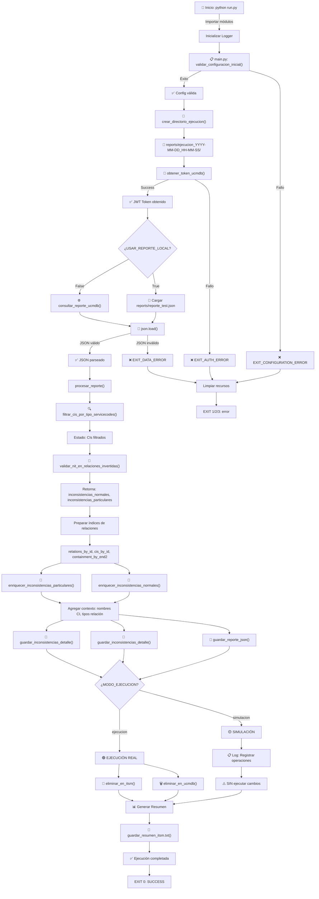
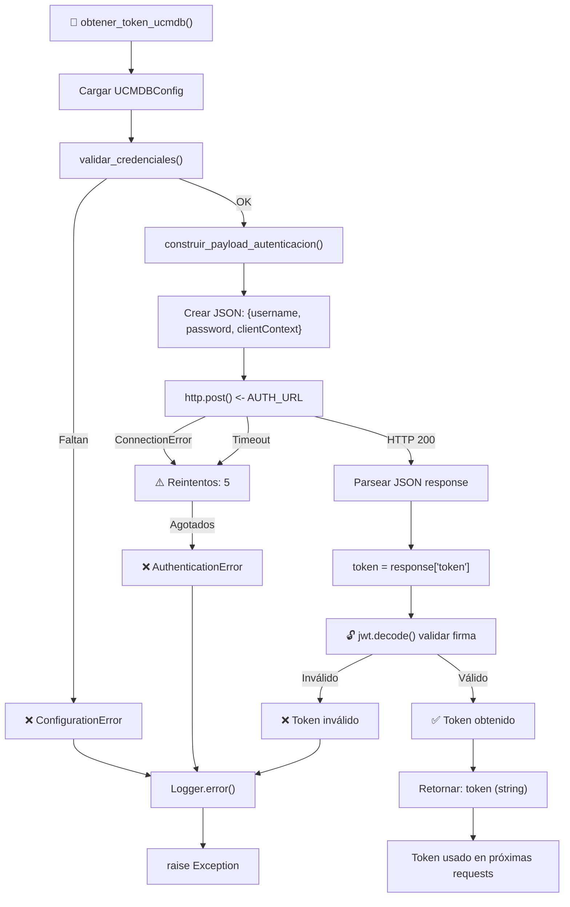
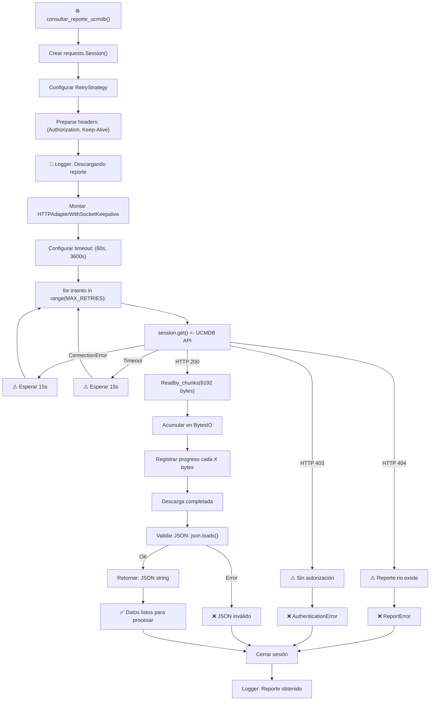
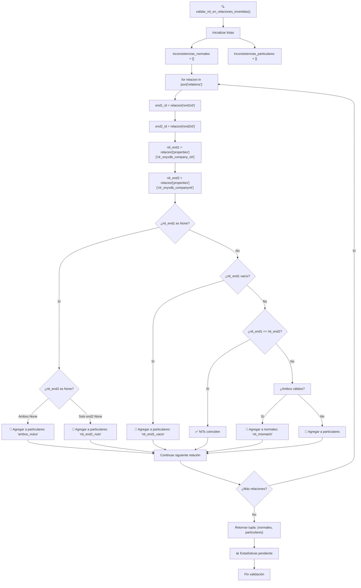
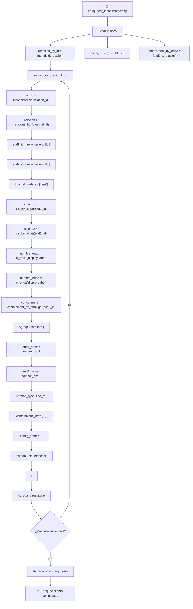
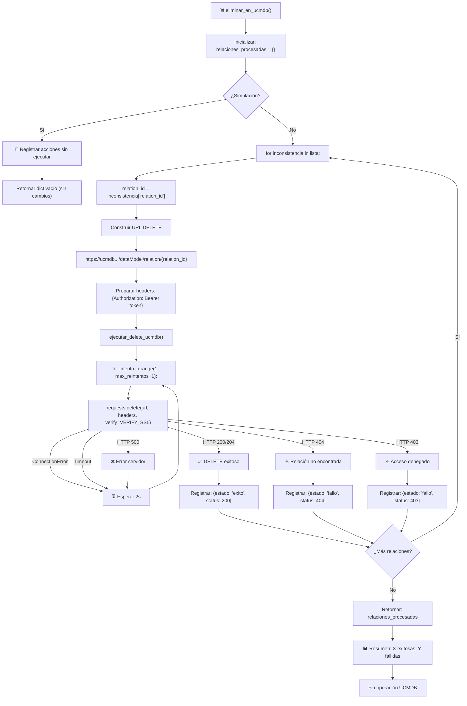
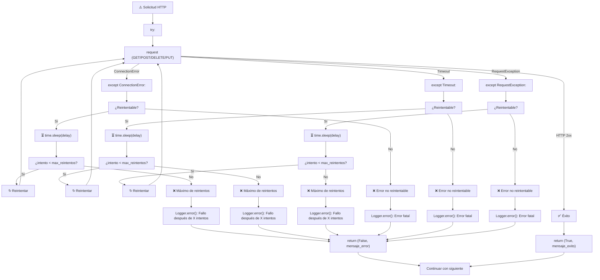
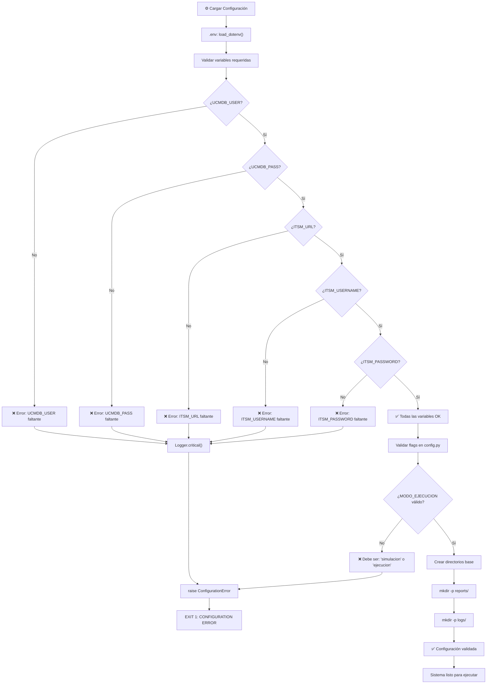

# Diagramas de Flujo Detallados - Script UCMDB

---

## 1. Flujo Principal (main.py)



---

## 2. Flujo de Autenticación (auth.py)



---

## 3. Flujo de Descarga de Reporte (report.py)



---

## 4. Flujo de Validación de NITs (report.py)



---

## 5. Flujo de Enriquecimiento de Datos (processor.py)



---

## 6. Flujo de Eliminación UCMDB (ucmdb_operations.py)



---

## 7. Flujo de Actualización ITSM (itsm_operations.py)

```mermaid
graph TD
    START["🔄 eliminar_en_itsm()"] --> INIT["Inicializar: relaciones_procesadas = {}"]
    
    INIT --> CHECK_MODE{¿Simulación?}
    
    CHECK_MODE -->|Sí| LOG_SIM["📝 Registrar actualizaciones sin ejecutar"]
    LOG_SIM --> RET_SIM["Retornar dict vacío (sin cambios)"]
    
    CHECK_MODE -->|No| LOOP["for inconsistencia in lista:"]
    
    LOOP --> EXTRACT["relation_id = inconsistencia['relation_id']"]
    EXTRACT --> BUILD_URL["Construir URL PUT"]
    BUILD_URL --> URL["ITSM_URL/relaciones/{relation_id}"]
    
    URL --> PAYLOAD["Crear payload: {\"state\": \"Removed\"}"]
    PAYLOAD --> HEADERS["Preparar headers:"]
    HEADERS --> AUTH["  Authorization: Basic {username:password en base64}"]
    AUTH --> CONTENT["  Content-Type: application/json"]
    
    CONTENT --> UPDATE_CALL["ejecutar_update_itsm()"]
    
    UPDATE_CALL --> FOR_RETRY["for intento in range(1, max_reintentos+1):"]
    
    FOR_RETRY --> REQ_PUT["requests.put(url, json=payload, headers, auth)"]
    
    REQ_PUT -->|ConnectionError| RETRY_DELAY["⏳ Esperar 2s"]
    RETRY_DELAY --> FOR_RETRY
    
    REQ_PUT -->|Timeout| RETRY_DELAY
    
    REQ_PUT -->|HTTP 200/201| LOG_OK["✅ PUT exitoso"]
    REQ_PUT -->|HTTP 404| LOG_NOT_FOUND["⚠️ Relación no existe en ITSM"]
    REQ_PUT -->|HTTP 401| LOG_UNAUTH["⚠️ Autenticación fallida"]
    REQ_PUT -->|HTTP 400| LOG_BADREQ["⚠️ Payload inválido"]
    REQ_PUT -->|HTTP 500| LOG_ERROR["❌ Error servidor"]
    
    LOG_OK --> RECORD_OK["Registrar: {estado: 'exito', status: 200}"]
    LOG_NOT_FOUND --> RECORD_4["Registrar: {estado: 'fallo', status: 404}"]
    LOG_UNAUTH --> RECORD_U["Registrar: {estado: 'fallo', status: 401}"]
    LOG_BADREQ --> RECORD_B["Registrar: {estado: 'fallo', status: 400}"]
    LOG_ERROR --> RETRY_DELAY
    
    RECORD_OK --> NEXT_REL{¿Más relaciones?}
    RECORD_4 --> NEXT_REL
    RECORD_U --> NEXT_REL
    RECORD_B --> NEXT_REL
    
    NEXT_REL -->|Sí| LOOP
    NEXT_REL -->|No| RETURN["Retornar: relaciones_procesadas"]
    
    RETURN --> LOG_SUMMARY["📊 Resumen: X actualizadas, Y fallidas"]
    LOG_SUMMARY --> END["Fin operación ITSM"]
```

---

## 8. Flujo de Manejo de Errores y Reintentos



---

## 9. Flujo de Generación de Reportes

```mermaid
graph TD
    START["📊 Generar Reportes"] --> INIT["Carpeta: reports/ejecucion_TIMESTAMP/"]
    
    INIT --> SAVE_JSON["guardar_reporte_json()"]
    SAVE_JSON --> JSON_FILE["✅ reporte_TIMESTAMP.json"]
    JSON_FILE --> JSON_CONTENT["Contenido: JSON completo"]
    
    JSON_CONTENT --> SAVE_NORM["guardar_inconsistencias_detalle()"]
    SAVE_NORM --> NORM_FILE["✅ inconsistencias.txt"]
    NORM_FILE --> NORM_CONTENT["Formato: Listado formateado"]
    
    NORM_CONTENT --> SAVE_PART["guardar_inconsistencias_detalle()"]
    SAVE_PART --> PART_FILE["✅ inconsistencias_particulares.txt"]
    PART_FILE --> PART_CONTENT["Formato: Casos especiales"]
    
    PART_CONTENT --> SAVE_SUMM["generar_resumen()"]
    SAVE_SUMM --> SUMM_FILE["✅ resumen_itsm.txt"]
    SUMM_FILE --> SUMM_CONTENT["Contenido:"]
    
    SUMM_CONTENT --> SUMM_STATS["- Estadísticas:"]
    SUMM_STATS --> SUMM_COUNT["  * Total inconsistencias"]
    SUMM_COUNT --> SUMM_NORM_C["  * Normales vs Particulares"]
    SUMM_NORM_C --> SUMM_DELETE["- Eliminaciones UCMDB:"]
    SUMM_DELETE --> SUMM_DELETE_OK["  * Exitosas: X"]
    SUMM_DELETE_OK --> SUMM_DELETE_FAIL["  * Fallidas: Y"]
    
    SUMM_DELETE_FAIL --> SUMM_UPDATE["- Actualizaciones ITSM:"]
    SUMM_UPDATE --> SUMM_UPDATE_OK["  * Exitosas: X"]
    SUMM_UPDATE_OK --> SUMM_UPDATE_FAIL["  * Fallidas: Y"]
    
    SUMM_UPDATE_FAIL --> SUMM_TIME["- Timestamps:"]
    SUMM_TIME --> SUMM_START["  * Inicio: TIMESTAMP"]
    SUMM_START --> SUMM_END["  * Fin: TIMESTAMP"]
    
    SUMM_END --> COPY_LOGS["Copiar logs"]
    COPY_LOGS --> LOG_FILE["logs/ucmdb_validation.log"]
    
    LOG_FILE --> FINAL["✅ Reportes generados"]
    FINAL --> LOCATION["📁 reports/ejecucion_YYYY-MM-DD_HH-MM-SS/"]
```



---

## 10. Flujo de Configuración y Validación



---

## Leyenda de Símbolos

| Símbolo | Significado |
|---------|------------|
| 🚀 | Inicio de proceso |
| 🛑 | Fin/Error fatal |
| ✅ | Éxito |
| ❌ | Error |
| ⚠️ | Advertencia/Problema |
| 📋 | Validación |
| 🔐 | Autenticación |
| 🌐 | Conexión/API |
| 📂 | Archivo/Carpeta |
| 🔍 | Búsqueda/Validación |
| 💜 | Enriquecimiento de datos |
| 🗑️ | Eliminación |
| 🔄 | Actualización |
| 📊 | Reporte/Estadística |
| 📝 | Logging/Registro |
| ⏳ | Espera/Delay |
| ↻ | Reintento |
| 🟡 | Simulación |
| 🟢 | Ejecución real |

---

**Fin de los Diagramas de Flujo Detallados**
