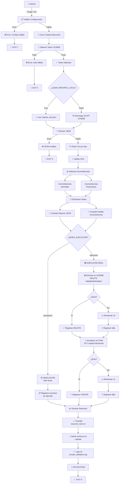

# Documentación Técnica - Script de Validación de NITs en UCMDB e ITSM

**Versión:** 1.0  
**Fecha:** Febrero 2026  
**Autor:** Script de Validación  

---

## 📋 Tabla de Contenidos

1. [Descripción General](#descripción-general)
2. [Estructura del Proyecto](#estructura-del-proyecto)
3. [Componentes Principales](#componentes-principales)
4. [Flujo de Ejecución](#flujo-de-ejecución)
5. [Diagrama de Flujo](#diagrama-de-flujo)
6. [Modelos de Datos](#modelos-de-datos)
7. [Configuración](#configuración)
8. [Variables de Entorno](#variables-de-entorno)
9. [Guía de Instalación](#guía-de-instalación)
10. [Guía de Ejecución](#guía-de-ejecución)
11. [Códigos de Salida](#códigos-de-salida)
12. [Troubleshooting](#troubleshooting)

---

## 1. Descripción General

### Propósito

Este script Python valida la **consistencia de NITs** (Números de Identificación Tributaria) en dos sistemas integrados:
- **UCMDB** (Unified Change and Configuration Management Database)
- **ITSM** (IT Service Management)

### Funcionalidades Principales

✅ **Autenticación**
- Conecta con la API REST de UCMDB usando JWT
- Autenticación Basic Auth en ITSM

✅ **Descarga de Reportes**
- Obtiene reportes JSON de relaciones desde UCMDB
- Soporta lectura desde archivo local para pruebas

✅ **Validación de NITs**
- Valida consistencia de NITs en relaciones
- Detecta inconsistencias "normales" y "particulares"

✅ **Procesamiento de Datos**
- Enriquece inconsistencias con información adicional
- Genera reportes detallados

✅ **Ejecución de Operaciones**
- Modo simulación (DRY-RUN) para pruebas
- Modo ejecución para eliminaciones reales
- Elimina relaciones en UCMDB (DELETE)
- Marca relaciones como "Removed" en ITSM (PUT)

✅ **Generación de Reportes**
- JSON completo del análisis
- Archivos de texto de inconsistencias
- Resumen ejecutivo
- Logs detallados

---

## 2. Estructura del Proyecto

```
Script UCMDB/
├── run.py                          # Punto de entrada principal
├── requirements.txt                # Dependencias Python
├── README.md                       # Documentación general
├── DOCUMENTACION_TECNICA.md        # Este archivo
│
├── src/                            # Código fuente
│   ├── __init__.py
│   ├── main.py                     # Lógica principal y orquestación
│   ├── config.py                   # Configuración centralizada
│   ├── auth.py                     # Autenticación UCMDB
│   ├── logger_config.py            # Configuración de logging
│   ├── report.py                   # Generación de reportes
│   ├── processor.py                # Procesamiento de datos
│   ├── ucmdb_operations.py         # Operaciones UCMDB (DELETE)
│   ├── itsm_operations.py          # Operaciones ITSM (PUT)
│   └── __pycache__/
│
├── logs/                           # Archivos de log
│   └── ucmdb_validation.log        # Log principal
│
├── reports/                        # Reportes generados
│   ├── ejecucion_2026-01-30_12-24-37/
│   ├── ejecucion_2026-01-30_14-24-31/
│   ├── ejecucion_2026-02-17_12-20-35/
│   └── reporte_test.json           # Reporte local para pruebas
│
└── tests/                          # Pruebas unitarias (futuro)
    └── __init__.py
```

---

## 3. Componentes Principales

### 3.1 `run.py` - Punto de Entrada

**Rol:** Actúa como punto de entrada único desde la raíz del proyecto.

```python
# Agregar directorio raíz al path de Python
root_path = Path(__file__).parent
sys.path.insert(0, str(root_path))

from src.main import main
sys.exit(main())
```

**Características:**
- Permite ejecutar: `python run.py`
- No requiere navegar a `src/`
- Captura código de salida correctamente

---

### 3.2 `config.py` - Configuración Centralizada

**Rol:** Centraliza toda la configuración del proyecto.

#### Clases Principales:

**`ExecutionFlags`** - Controla el comportamiento de ejecución
```python
class ExecutionFlags:
    MODO_EJECUCION = "simulacion"      # "simulacion" | "ejecucion"
    USAR_REPORTE_LOCAL = False         # True para JSON local
    GENERAR_RESUMEN = True             # Generar archivos resumen
    CREAR_CARPETA_EJECUCION = True     # Crear carpeta con timestamp
```

**`UCMDBConfig`** - Configuración UCMDB
```python
@dataclass
class UCMDBConfig:
    AUTH_URL = "https://ucmdbapp.triara.co:8443/rest-api/authenticate"
    BASE_URL = "https://ucmdbapp.triara.co:8443/rest-api/topology"
    DELETE_ENDPOINT = "https://ucmdbapp.triara.co:8443/rest-api/dataModel/relation"
    
    CONNECT_TIMEOUT = 60
    READ_TIMEOUT = 3600      # 1 hora para descargas grandes
    
    USERNAME = os.getenv("UCMDB_USER")
    PASSWORD = os.getenv("UCMDB_PASS")
```

**`ITSMConfig`** - Configuración ITSM
```python
@dataclass
class ITSMConfig:
    BASE_URL = os.getenv("ITSM_URL")
    USERNAME = os.getenv("ITSM_USERNAME")
    PASSWORD = os.getenv("ITSM_PASSWORD")
    
    TIMEOUT = 30
    MAX_RETRIES = 3
```

**`ReportConfig`** - Configuración de reportes
```python
class ReportConfig:
    RUTA_REPORTE_LOCAL = REPORTS_BASE_DIR / "reporte_test.json"
    REPORT_NAME = "Reporte_Clientes_Onyx-uCMDB"
```

---

### 3.3 `auth.py` - Autenticación UCMDB

**Rol:** Gestiona la autenticación con UCMDB.

#### Funciones Principales:

| Función | Entrada | Salida | Descripción |
|---------|---------|--------|-------------|
| `obtener_token_ucmdb()` | - | `str` | Obtiene token JWT de UCMDB |
| `validar_credenciales()` | `config` | `(user, pass)` | Valida credenciales en .env |
| `construir_payload_autenticacion()` | `user, pass, config` | `dict` | Construye payload JSON |

**Flujo de Autenticación:**
```
Request: POST /rest-api/authenticate
├── Headers: Content-Type: text/plain
├── Body: {"username": "user", "password": "pass", "clientContext": 1}
└── Response: JWT token

Token se almacena en memoria para peticiones posteriores
```

**Manejo de Errores:**
- `AuthenticationError`: Fallo de autenticación
- `ConfigurationError`: Credenciales faltantes en .env

---

### 3.4 `report.py` - Generación de Reportes

**Rol:** Gestiona la consulta y procesamiento de reportes desde UCMDB.

#### Funciones Principales:

| Función | Entrada | Salida |
|---------|---------|--------|
| `consultar_reporte_ucmdb()` | `token, config` | `str` (JSON) |
| `filtrar_cis_por_tipo_servicecodes()` | `json_data` | `List[Dict]` |
| `validar_nit_en_relaciones_invertidas()` | `json_data` | `(inconsistencias_normales, inconsistencias_particulares)` |

#### Validación de NITs:

**Inconsistencias Normales:**
- NIT end1 ≠ NIT end2
- Ambos campos parcialmente válidos

**Inconsistencias Particulares:**
- Uno o ambos NITs nulos
- Formato inválido
- Falta información crítica

#### Manejo de Conexiones Largas:

```python
class HTTPAdapterWithSocketKeepalive(HTTPAdapter):
    """Mantiene conexiones de larga duración vivas"""
    - Socket keep-alive habilitado
    - TCP_NODELAY para baja latencia
    - Ideal para descargas de >250 MB
```

---

### 3.5 `processor.py` - Procesamiento de Datos

**Rol:** Procesa y enriquece datos de inconsistencias.

#### Funciones Principales:

| Función | Entrada | Salida | Descripción |
|---------|---------|--------|-------------|
| `crear_directorio_ejecucion()` | - | `Path` | Crea carpeta timestamp |
| `validar_integridad_json()` | `json_data` | `bool` | Valida estructura JSON |
| `guardar_reporte_json()` | `data, folder` | `Path` | Guarda JSON completo |
| `guardar_inconsistencias_detalle()` | `inconsistencias, folder` | `Path` | Guarda detalles |
| `enriquecer_inconsistencias_normales()` | `inconsistencias, relations` | `List[Dict]` | Agrega contexto |
| `enriquecer_inconsistencias_particulares()` | `inconsistencias, relations` | `List[Dict]` | Agrega contexto |

#### Enriquecimiento de Datos:

Cada inconsistencia se enriquece con:
- ✅ Información de la relación (tipo, IDs)
- ✅ Datos de nodos conectados
- ✅ Relaciones contenimiento asociadas
- ✅ Contexto de configuración (IT/Hosting)

---

### 3.6 `ucmdb_operations.py` - Operaciones UCMDB

**Rol:** Ejecuta operaciones DELETE en UCMDB.

#### Funciones Principales:

| Función | Entrada | Salida |
|---------|---------|--------|
| `ejecutar_delete_ucmdb()` | `url, token` | `(bool, str)` |
| `eliminar_en_ucmdb()` | `inconsistencias, token, modo` | `dict` |

#### Estrategia DELETE:

```
Para cada inconsistencia:
├── Modo SIMULACION:
│   └── Registra acción, no ejecuta
└── Modo EJECUCION:
    ├── Construye URL delete
    ├── Ejecuta DELETE con reintentos (max 3)
    ├── Registra resultado
    └── Continúa si falla (sin detener)
```

#### Reintentos Automáticos:

- Intentos: 3
- Delay entre intentos: 2 segundos
- Status codes esperados: 200, 204

---

### 3.7 `itsm_operations.py` - Operaciones ITSM

**Rol:** Ejecuta operaciones PUT en ITSM para marcar relaciones como "Removed".

#### Funciones Principales:

| Función | Entrada | Salida |
|---------|---------|--------|
| `ejecutar_update_itsm()` | `url, config` | `(bool, str)` |
| `eliminar_en_itsm()` | `inconsistencias, modo` | `dict` |

#### Estrategia PUT:

```
Para cada inconsistencia:
├── Construye payload JSON {"state": "Removed"}
├── Modo SIMULACION:
│   └── Registra acción, no ejecuta
└── Modo EJECUCION:
    ├── Ejecuta PUT con Basic Auth
    ├── Reintentos automáticos (max 3)
    ├── Registra resultado
    └── Continúa si falla
```

#### Autenticación ITSM:

```python
# Basic Auth: username:password codificado en Base64
Authorization: Basic base64(username:password)
Content-Type: application/json
```

---

### 3.8 `main.py` - Lógica Principal

**Rol:** Orquesta todo el flujo de ejecución.

#### Pasos Principales:

```
1. Validar configuración inicial
2. Crear carpeta de ejecución (con timestamp)
3. Obtener token JWT de UCMDB
4. Consultar reporte JSON (API o local)
5. Procesar reporte:
   ├── Filtrar CIs
   ├── Validar NITs
   ├── Enriquecer datos
   └── Guardar reportes parciales
6. Ejecutar operaciones:
   ├── Eliminaciones UCMDB
   ├── Actualizaciones ITSM
   └── Guardar rastreo
7. Generar resumen final
```

---

## 4. Flujo de Ejecución

### Flujo Principal Simplificado

```
START
  ↓
┌─────────────────────────────────────────┐
│ 1. INICIALIZACIÓN                       │
│ - Validar configuración                 │
│ - Crear estructura carpetas             │
│ - Configurar logging                    │
└─────────────────────────────────────────┘
  ↓
┌─────────────────────────────────────────┐
│ 2. AUTENTICACIÓN                        │
│ - Conectar con UCMDB                    │
│ - Obtener token JWT                     │
│ - Validar credenciales                  │
└─────────────────────────────────────────┘
  ↓
┌─────────────────────────────────────────┐
│ 3. OBTENCIÓN DE DATOS                   │
│ - Si USAR_REPORTE_LOCAL=True            │
│   └─ Leer de reporte_test.json          │
│ - Si USAR_REPORTE_LOCAL=False           │
│   └─ Descargar desde UCMDB API          │
└─────────────────────────────────────────┘
  ↓
┌─────────────────────────────────────────┐
│ 4. VALIDACIÓN DE DATOS                  │
│ - Validar estructura JSON               │
│ - Filtrar CIs por tipo                  │
│ - Detectar inconsistencias              │
└─────────────────────────────────────────┘
  ↓
┌─────────────────────────────────────────┐
│ 5. ENRIQUECIMIENTO                      │
│ - Agregar contexto a inconsistencias    │
│ - Mapear relaciones                     │
│ - Generar reportes intermedios          │
└─────────────────────────────────────────┘
  ↓
┌─────────────────────────────────────────┐
│ 6. EJECUCIÓN O SIMULACIÓN               │
│ - MODO="simulacion": Solo registra      │
│ - MODO="ejecucion": Realiza cambios     │
│                                         │
│ A. Eliminar en UCMDB (DELETE)           │
│ B. Actualizar en ITSM (PUT)             │
│ C. Registrar resultados                 │
└─────────────────────────────────────────┘
  ↓
┌─────────────────────────────────────────┐
│ 7. GENERACIÓN DE REPORTES               │
│ - JSON completo del análisis            │
│ - Archivos TXT detallados               │
│ - Resumen ejecutivo                     │
│ - Logs de ejecución                     │
└─────────────────────────────────────────┘
  ↓
END (Código de salida: 0 = éxito, otro = error)
```

---

## 5. Diagrama de Flujo

### Diagrama de Flujo Completo (Mermaid)



### Estados de Ejecución

```
INICIO
  │
  ├─► VALIDACIÓN FALLÓ
  │   └─► EXIT CODE: 1
  │
  ├─► AUTENTICACIÓN FALLÓ
  │   └─► EXIT CODE: 2
  │
  ├─► DATOS INVÁLIDOS
  │   └─► EXIT CODE: 3
  │
  ├─► MODO SIMULACIÓN ✓
  │   └─► EXIT CODE: 0 (sin cambios en BD)
  │
  └─► MODO EJECUCIÓN ✓
      ├─ Eliminaciones UCMDB: OK
      ├─ Actualizaciones ITSM: OK
      └─► EXIT CODE: 0 (cambios realizados)
```

---

## 6. Modelos de Datos

### 6.1 Estructura JSON del Reporte UCMDB

```json
{
  "cis": [
    {
      "ucmdbId": "string",
      "type": "clr_onyxservicecodes",
      "displayLabel": "string",
      "properties": {
        "name": "string",
        "status": "string"
      }
    }
  ],
  "relations": [
    {
      "ucmdbId": "string",
      "type": "containment | clr_rel_companybranch",
      "end1Id": "string",
      "end2Id": "string",
      "properties": {
        "clr_onyxdb_company_nit": "string",      # NIT lado 1
        "clr_onyxdb_companynit": "string"        # NIT lado 2
      }
    }
  ]
}
```

### 6.2 Modelo de Inconsistencia (Normal)

```python
{
    "relation_id": "string",
    "relation_type": "string",
    "end1_id": "string",
    "end2_id": "string",
    "nit_end1": "string",           # Campo clr_onyxdb_company_nit
    "nit_end2": "string",           # Campo clr_onyxdb_companynit
    "mismatch_type": "nit_mismatch",
    "estado": "sin_procesar",       # "sin_procesar", "exito", "fallo"
}
```

### 6.3 Modelo de Inconsistencia (Particular)

```python
{
    "relation_id": "string",
    "end1_id": "string",
    "end2_id": "string",
    "nit_end1": null | "string",    # Puede ser nulo
    "nit_end2": null | "string",    # Puede ser nulo
    "issue_type": "nit_nulo",       # "nit_nulo", "nit_invalido", etc.
    "descripcion": "string",
    "estado": "sin_procesar",
}
```

### 6.4 Modelo de Resultado de Operación

```python
{
    "relacion_id": "string",
    "operacion": "ucmdb_delete",    # "ucmdb_delete", "itsm_update"
    "estado": "exito",              # "exito", "fallo"
    "codigo_http": 200,             # Status code HTTP
    "mensaje": "string",
    "timestamp": "2026-02-17T12:30:45.123456",
    "intentos": 1,                  # Número de intentos
}
```

---

## 7. Configuración

### 7.1 Archivo `.env` Requerido

Crear archivo `.env` en la raíz del proyecto:

```bash
# UCMDB
UCMDB_USER=tu_usuario_ucmdb
UCMDB_PASS=tu_contraseña_ucmdb

# ITSM
ITSM_URL=https://tu-itsm-url.com/api
ITSM_USERNAME=tu_usuario_itsm
ITSM_PASSWORD=tu_contraseña_itsm

# OPCIONAL - Control SSL (desarrollo solamente)
VERIFY_SSL=False      # True en producción
```

### 7.2 Configuración en `config.py`

**Flags principales que puedes modificar:**

```python
# El MODO de ejecución
ExecutionFlags.MODO_EJECUCION = "simulacion"   # "simulacion" o "ejecucion"

# Usar reporte local para pruebas
ExecutionFlags.USAR_REPORTE_LOCAL = False      # True = JSON local

# Generar archivos de resumen
ExecutionFlags.GENERAR_RESUMEN = True

# Crear carpeta con timestamp
ExecutionFlags.CREAR_CARPETA_EJECUCION = True
```

### 7.3 Configuración de Timeouts

```python
UCMDBConfig:
    CONNECT_TIMEOUT = 60        # 60 segundos para conectar
    READ_TIMEOUT = 3600         # 1 HORA para leer (descarga large)
    REQUEST_TIMEOUT = 30        # 30 segundos para requests normales

ITSMConfig:
    TIMEOUT = 30                # 30 segundos por request
```

---

## 8. Variables de Entorno

| Variable | Tipo | Requerido | Descripción |
|----------|------|-----------|-------------|
| `UCMDB_USER` | string | ✅ Sí | Usuario autenticación UCMDB |
| `UCMDB_PASS` | string | ✅ Sí | Contraseña UCMDB |
| `ITSM_URL` | URL | ✅ Sí | URL base API ITSM |
| `ITSM_USERNAME` | string | ✅ Sí | Usuario ITSM |
| `ITSM_PASSWORD` | string | ✅ Sí | Contraseña ITSM |
| `VERIFY_SSL` | bool | ❌ No | Verificar certificados SSL (default: False) |

---

## 9. Guía de Instalación

### Prerrequisitos

- Python 3.8+
- pip (gestor de paquetes Python)
- Acceso a APIs de UCMDB e ITSM

### Pasos

1. **Clonar o descargar el proyecto**
   ```bash
   cd "Script UCMDB"
   ```

2. **Crear ambiente virtual (recomendado)**
   ```bash
   python -m venv venv
   
   # En Windows:
   venv\Scripts\activate
   
   # En Linux/Mac:
   source venv/bin/activate
   ```

3. **Instalar dependencias**
   ```bash
   pip install -r requirements.txt
   ```

4. **Configurar variables de entorno**
   ```bash
   # Crear archivo .env en la raíz
   cp .env.example .env    # Si existe plantilla
   
   # Editar .env con credenciales reales
   ```

5. **Validar instalación**
   ```bash
   python run.py --help
   ```

---

## 10. Guía de Ejecución

### Ejecución Básica

```bash
python run.py
```

### Flujo Recomendado (IMPORTANTE)

**Paso 1: SIMULACIÓN (Prueba segura)**
```python
# En config.py
ExecutionFlags.MODO_EJECUCION = "simulacion"
ExecutionFlags.USAR_REPORTE_LOCAL = True       # Usar reporte test
ExecutionFlags.GENERAR_RESUMEN = True
```

```bash
python run.py
```

✅ Esto genera un "DRY-RUN" que:
- No modifica nada en UCMDB ni ITSM
- Mostrar lo que haría
- Permite revisar inconsistencias encontradas
- Genera reportes para análisis

**Paso 2: REVISAR REPORTES**

Los reportes se encuentran en:
```
reports/ejecucion_YYYY-MM-DD_HH-MM-SS/
├── reporte_TIMESTAMP.json           # JSON completo
├── inconsistencias.txt              # Detalle de inconsistencias
├── inconsistencias_particulares.txt # Casos especiales
└── resumen_itsm.txt                 # Resumen ejecutivo
```

**Paso 3: EJECUCIÓN REAL (Si todo está correcto)**

Una vez validada la simulación:

```python
# En config.py
ExecutionFlags.MODO_EJECUCION = "ejecucion"    # REAL
ExecutionFlags.USAR_REPORTE_LOCAL = False      # Descargar de API
```

```bash
python run.py
```

⚠️ Esto realizará:
- Eliminaciones reales en UCMDB (DELETE)
- Actualizaciones reales en ITSM (PUT)
- Cambios PERMANENTES en las bases de datos

### Ejecución con Parámetros

```bash
# Con salida verbose
python run.py --verbose

# Con reintentos personalizados
python run.py --retries 5

# Con timeout personalizado
python run.py --timeout 7200
```

### Monitorear Ejecución

**Terminal abierta:**
```bash
# Ver logs en tiempo real
tail -f logs/ucmdb_validation.log
```

**Después de la ejecución:**
```bash
# Ver último reporte generado
ls -lt reports/*/reporte_*.json | head -1

# Leer JSON formateado
python -m json.tool reports/ejecucion_*/reporte_*.json | less
```

---

## 11. Códigos de Salida

| Código | Descripción | Acción |
|--------|-------------|--------|
| **0** | ✅ Éxito | Ejecución completada correctamente |
| **1** | ❌ Error de configuración | Revisar variables de entorno y config.py |
| **2** | ❌ Fallo de autenticación | Verificar credenciales UCMDB |
| **3** | ❌ Error en datos JSON | Validar estructura del reporte |
| **4** | ❌ Error de procesamiento | Revisar logs para más detalles |
| **5** | ❌ Error de I/O | Revisar permisos de carpetas |

**Ejemplo:**
```bash
python run.py
echo $?          # Imprime código de salida
```

---

## 12. Troubleshooting

### Problema: "ModuleNotFoundError: No module named 'src'"

**Solución:**
```bash
# Ejecutar desde raíz del proyecto
cd "C:\Users\dange\Documents\Script UCMDB"
python run.py
```

---

### Problema: "Credenciales no definidas"

**Solución:**
1. Verificar que `.env` existe en raíz
2. Contiene variables correctas:
   ```bash
   UCMDB_USER=usuario
   UCMDB_PASS=contraseña
   ITSM_URL=https://...
   ITSM_USERNAME=usuario
   ITSM_PASSWORD=contraseña
   ```
3. Sin espacios alrededor de `=`

---

### Problema: "Timeout en descarga de reporte"

**Solución:**
- El reporte es >250 MB
- Aumentar timeout en `config.py`:
  ```python
  UCMDBConfig.READ_TIMEOUT = 7200  # 2 horas
  ```

---

### Problema: "Error SSL certificate_verify_failed"

**Solución (Desarrollo):**
```bash
# En .env
VERIFY_SSL=False
```

**Alternativa (Producción):**
```bash
# Configurar certificado correcto
# Contactar a administrador de UCMDB
```

---

### Problema: "Archivo reporte_test.json no existe"

**Solución:**
- Si `USAR_REPORTE_LOCAL = True`
- Necesita archivo en: `reports/reporte_test.json`
- Opción 1: Cambiar a `USAR_REPORTE_LOCAL = False` (descargar de API)
- Opción 2: Proporcionar archivo JSON válido

---

### Problema: "Permisos denegados en carpeta reports/"

**Solución:**
```bash
# En Windows (PowerShell Admin):
icacls "C:\Users\dange\Documents\Script UCMDB\reports" /grant:r "$env:USERNAME:(OI)(CI)F"

# En Linux:
chmod -R 755 reports/
```

---

### Problema: Logs no se generan

**Solución:**
```bash
# Verificar permisos en carpeta logs/
ls -la logs/

# Crear manualmente si no existe
mkdir -p logs
touch logs/ucmdb_validation.log
chmod 666 logs/ucmdb_validation.log
```

---

### Problema: "MODO_EJECUCION inválido"

**Solución:**
```python
# En config.py, debe ser exactamente:
ExecutionFlags.MODO_EJECUCION = "simulacion"  # O
ExecutionFlags.MODO_EJECUCION = "ejecucion"   # No otros valores
```

---

## Diagrama de Arquitectura

```
┌─────────────────────────────────────────────────────────────┐
│                   Script UCMDB                              │
│                                                             │
│  ┌──────────────────────────────────────────────────────┐   │
│  │              main.py (Orquestación)                  │   │
│  └──────────────────────────────────────────────────────┘   │
│         ↓              ↓              ↓               ↓      │
│  ┌──────────┐  ┌──────────┐  ┌──────────┐  ┌─────────────┐ │
│  │ config   │  │  auth    │  │ report   │  │ processor   │ │
│  │.py       │  │.py       │  │.py       │  │.py          │ │
│  └──────────┘  └──────────┘  └──────────┘  └─────────────┘ │
│                      ↓                            ↓          │
│                 [JWT Token]               [Datos Enriquecidos]
│                                                             │
│  ┌──────────────────────────────────────────────────────┐   │
│  │     ucmdb_operations.py  │  itsm_operations.py       │   │
│  │     (DELETE en UCMDB)    │   (PUT en ITSM)          │   │
│  └──────────────────────────────────────────────────────┘   │
│         ↓                              ↓                    │
└─────────────────────────────────────────────────────────────┘
         ↓                              ↓
    ┌─────────────┐              ┌─────────────┐
    │   UCMDB     │              │    ITSM     │
    │   (Elimina) │              │  (Actualiza)│
    └─────────────┘              └─────────────┘
         ↓                              ↓
    [Relaciones    ]            [Estado = Removed]
    [eliminadas]
         ↓
    ┌─────────────────────────────────────────┐
    │  Reportes (reports/)                    │
    │  ├─ reporte_TIMESTAMP.json              │
    │  ├─ inconsistencias.txt                 │
    │  ├─ inconsistencias_particulares.txt    │
    │  └─ resumen_itsm.txt                    │
    └─────────────────────────────────────────┘
         ↓
    ┌─────────────────────────────────────────┐
    │  Logs (logs/ucmdb_validation.log)       │
    └─────────────────────────────────────────┘
```

---

## Resumen de Características

✅ **Seguridad**
- Autenticación JWT (UCMDB)
- Basic Auth (ITSM)
- Validación de credenciales
- Modo simulación para pruebas seguras

✅ **Confiabilidad**
- Reintentos automáticos en fallos
- Keep-alive para conexiones largas
- Validación de integridad JSON
- Logging detallado

✅ **Flexibilidad**
- Modo simulación vs ejecución
- Reportes locales para pruebas
- Configuración centralizada
- Timeouts personalizables

✅ **Auditoría**
- Reportes JSON detallados
- Archivos de inconsistencias
- Resumen ejecutivo
- Logs persistentes

---

## Contacto y Soporte

Para issues o preguntas:
1. Revisar logs en `logs/ucmdb_validation.log`
2. Consultar reportes en `reports/`
3. Validar configuración en `.env`
4. Contactar al administrador de infraestructura

---

**Fin de la Documentación Técnica**  
*Última actualización: Febrero 2026*
